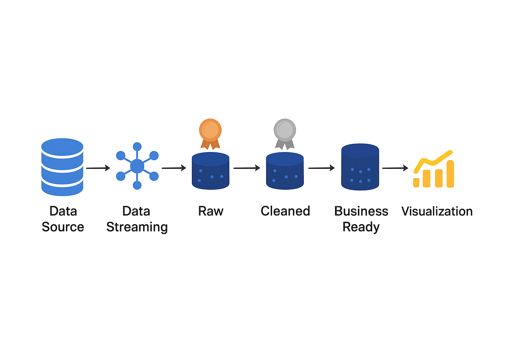

# Real-Time-Patient-Vital-Signs-Data-Pipeline
Ce projet présente une architecture complète pour la collecte, le traitement, le nettoyage, l’enrichissement et la visualisation des données de constantes vitales patients. Il illustre une chaîne moderne de data engineering basée sur des composants cloud et un flux orienté streaming.

